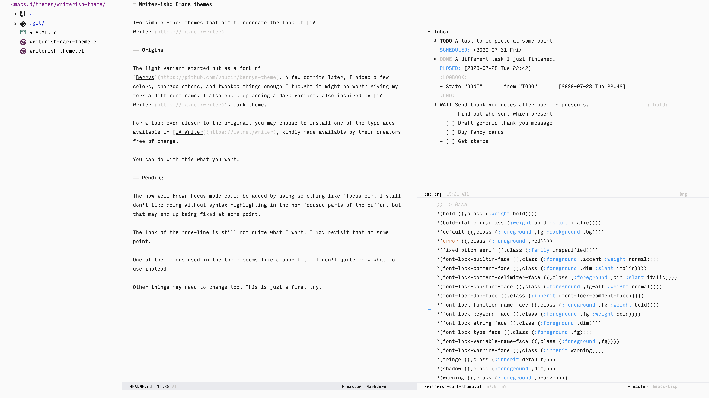
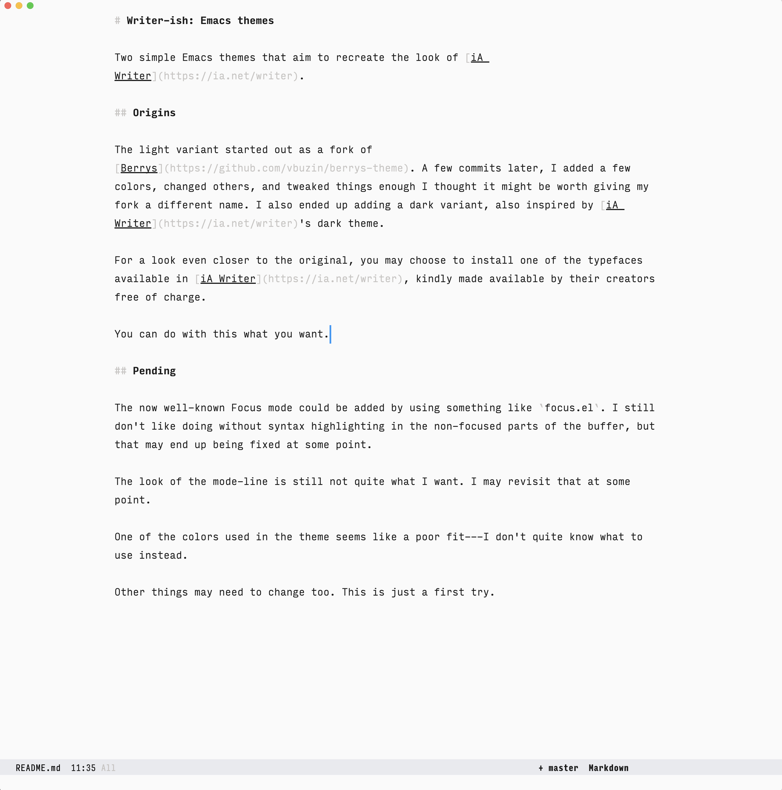
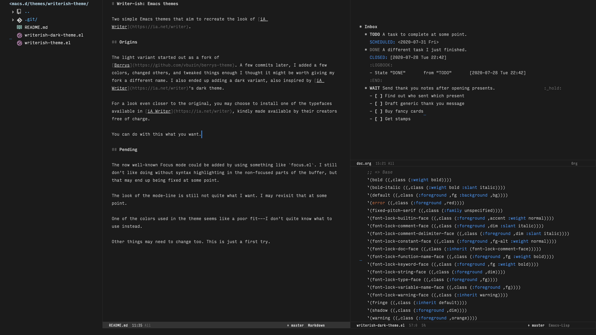
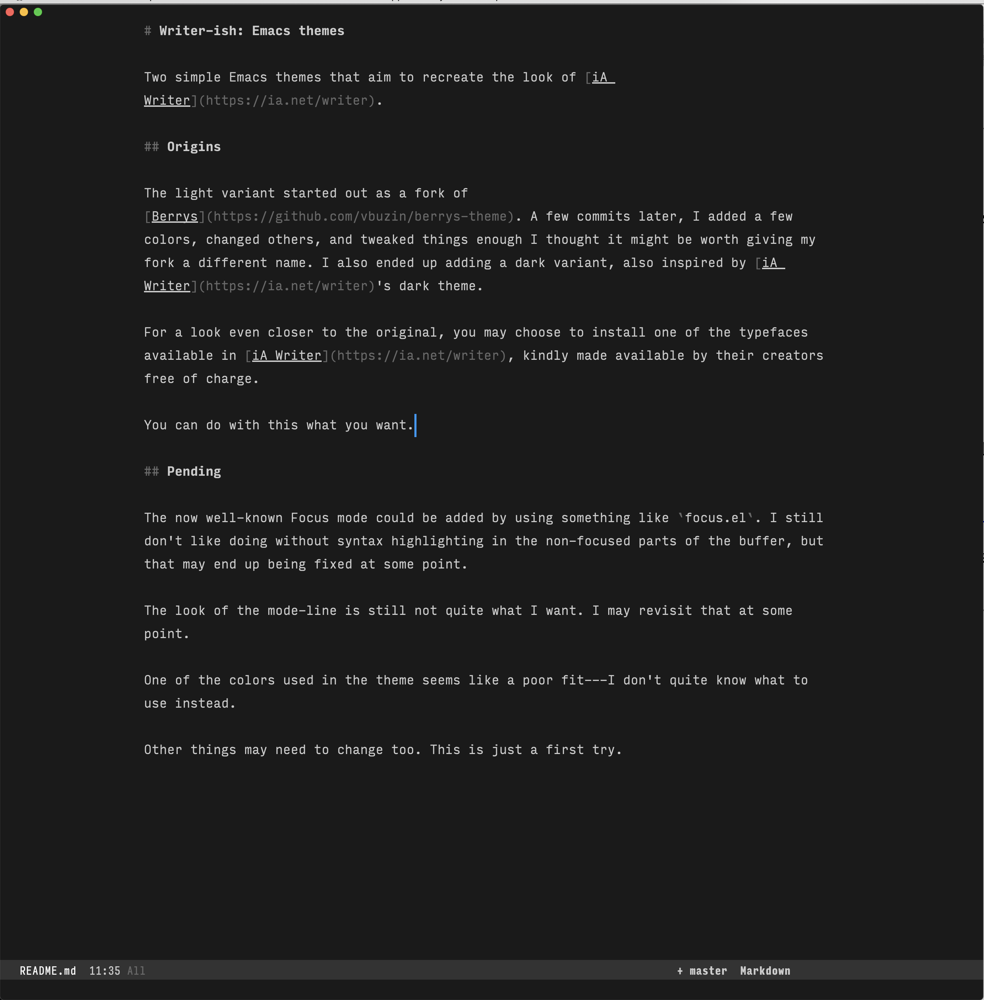

# Writer-ish: Emacs themes

Two simple Emacs themes that aim to recreate the look of [iA Writer](https://ia.net/writer). Very much a work in progress.

(Note: The now well-known Focus mode could be added by using something like [Focus](https://github.com/larstvei/Focus).)

## Origins

The light variant started out as a fork of [Berrys](https://github.com/vbuzin/berrys-theme). A few commits later, I added a few colors, changed others, and tweaked things enough that I thought it might be worth giving my fork a different name. I also ended up adding a dark variant, also inspired by [iA Writer](https://ia.net/writer)'s dark theme.

For a look even closer to the original, you may choose to install one of [the typefaces](https://github.com/iaolo/iA-Fonts) available in [iA Writer](https://ia.net/writer), kindly made available by their creators free of charge.

You can do with this what you want.

## Screenshots

The fonts used on the screenshots below are from the [Input](https://input.fontbureau.com) family. I use Input Mono throughout, except for the mode-line, where I use Input Mono Compressed.

```elisp
(set-face-attribute 'default nil :height 181  :font "Input" :weight 'regular)
(set-face-attribute 'mode-line nil :font "Input Mono Compressed" :height 161 :weight 'regular)
(set-face-attribute 'mode-line-inactive nil :font "Input Mono Compressed" :height 161 :weight 'regular)
```

For some reason, switching themes kept setting the font for the `mode-line` face to be the same as the one for `default`. So you may want to use the following to toggle between themes:

```elisp
(defun writerish/set-light ()
  (interactive)
  (disable-theme 'writerish-dark)
  (load-theme 'writerish t)
  (set-face-attribute 'mode-line nil :font "Input Mono Compressed" :height 161 :weight 'regular)
  (set-face-attribute 'mode-line-inactive nil :font "Input Mono Compressed" :height 161 :weight 'regular)
  )

(defun writerish/set-dark ()
  (interactive)
  (disable-theme 'writerish)
  (load-theme 'writerish-dark t)
  (set-face-attribute 'mode-line nil :font "Input Mono Compressed" :height 161 :weight 'regular)
  (set-face-attribute 'mode-line-inactive nil :font "Input Mono Compressed" :height 161 :weight 'regular)
  )
```


Getting a comfortable line spacing while having the cursor look right required using a font with an adjustable line height. Input allows you to do that, so setting the line-height to 1.5x before downloading works with this:

```elisp
(setq-default line-spacing 0.15)
```

Finally, I believe the window divider is not yet set by the theme, but rather by this line in my config:

```elisp
(set-face-foreground 'window-divider (face-background 'header-line))
```

This may end up being part of the theme at some point.

### Light theme (writerish)




### Dark theme (writerish-dark)



